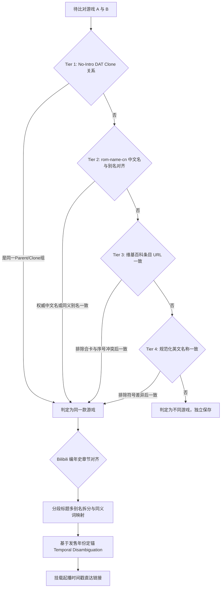

# 模拟器 ROM 信息库 (Emu ROM Info)

本项目用于抓取、清洗并跨区整合各大经典游戏主机（NES、FC、SFC、MD 等）的游戏信息：
1. **跨区深度融合**：结合 No-Intro 官方 DAT 克隆树与 rom-name-cn 权威对照库，智能判定并合并美版与日版（及卡带/磁碟机）属于同一款游戏的所有版本，保存于统一数据结构中；
2. **B站视频编年史联动**：抓取 B 站知名 UP 主合集[《红白机游戏编年史系列》](https://space.bilibili.com/3546818172423070/lists/4877626)（全 98 期），提取简介中的分段章节时间轴，通过多模态名称规范与年份定锚引擎，为 **846 款游戏** 精准绑定了解说视频与带起播秒数的直达链接！

---

## 核心判定与对齐引擎：多源数据融合

在判断“美版 (NES) 与日版 (FC/FDS) 是否为同一款游戏的不同版本”以及与“B站编年史解说分段精准对齐”时，系统构建了多层判定层级：



1. **Tier 1: No-Intro DAT 克隆树判定（最高权威）**：
   直接解析两个 `.dat` 文件中的 Parent-Clone 结构。过滤 Pirate/Bootleg 非官方干扰，即使美版和日版标题完全不同（如美版叫 `Casino Kid`，日版叫 `100万$キッド`），也能精准识别并合并。
2. **Tier 2: rom-name-cn 权威对照与同义别名判定**：
   解析 `rom-name-cn` 中 4,000+ 条对照映射及 `name_alias(Chinese).json`，通过民间权威中文译名与同义别名库对齐美日版本。
3. **Tier 3: 维基百科条目一致性判定**：
   同一维基百科条目的跨语言版本进行对齐（自动防御合卡与续作代数冲突）。
4. **Tier 4: 规范化英文名称一致性判定**：
   展开 `$` 与 `&` 等符号，标准化比对英文名称。
5. **Tier 5: Bilibili 编年史分段章节精准对齐**：
   提取全 98 期视频章节时间轴（1,179 个分段），融合多别名拆分、副标题切分、同义俗名转换及视频发售年份定锚（Temporal Disambiguation），成功对齐 846 款游戏。

---

## FC / NES 跨区深度整合统计

| 统计分类项 | 数量 | 说明 |
| :--- | :---: | :--- |
| **原始维基条目总数** | **1,961** 条 | NES (709) + FC磁碟机 (199) + 红白机卡带 (1053) |
| **美日同款跨区游戏** | **327** 款 | **融合 DAT 与 rom-name-cn 后识别并合并的美日同款游戏** |
| **多平台版本游戏总计** | **337** 款 | 涵盖 2 个或 3 个平台版本的经典游戏 |
| **NES 欧美独占游戏** | **379** 款 | 仅在欧美 NES 发售的游戏 |
| **日本地区独占游戏** | **885** 款 | 仅在日本发售的红白机卡带或磁碟机游戏 |
| **整合后独立游戏总数** | **1,591** 款 | 消除跨国别名孤岛后的独立游戏实体总数 |
| **中文名成功补全数** | **434** 款 | 利用 rom-name-cn 补齐维基原先缺失的中文名称 |
| **B站解说视频匹配数** | **846** 款 | 成功对齐视频解说并附带起播秒数直达播放链接（覆盖率 53.2%） |

---

## 合并数据结构示例

```json
{
  "id": "casino-kid",
  "title_zh": "赌场小子",
  "title_en": "Casino Kid",
  "title_ja": "100万$キッド 幻の帝王編",
  "is_cross_region": true,
  "platforms": [
    "FC",
    "NES"
  ],
  "publishers": [
    "SOFEL"
  ],
  "wiki_url": "",
  "release_dates": {
    "japan": "1989年1月6日",
    "north_america": "1989年10月",
    "europe": ""
  },
  "versions": {
    "NES": {
      "platform": "NES",
      "platform_name": "Nintendo Entertainment System",
      "title_zh": "赌场小子",
      "title_en": "Casino Kid",
      "title_ja": "",
      "release_date_na": "1989年10月",
      "publisher": "SOFEL",
      "region": "NA/PAL"
    },
    "FC": {
      "platform": "FC",
      "platform_name": "Family Computer",
      "title_zh": "百万小子：梦幻的帝王编",
      "title_en": "100 Man $ Kid - Maboroshi no Teiou Hen",
      "title_ja": "100万$キッド 幻の帝王編",
      "release_date": "1989年1月6日",
      "publisher": "SOFEL",
      "region": "JP"
    }
  },
  "video": {
    "bvid": "BV1BvAReEEig",
    "aid": 114057067632295,
    "video_title": "【红白机游戏编年史01】-1983年 | 4K",
    "chapter_name": "大力水手",
    "timestamp": "08:46",
    "seconds": 526,
    "url": "https://www.bilibili.com/video/BV1BvAReEEig/?t=526"
  }
}
```

---

## 目录与文件列表

```text
emu-rom-info/
├── fetch_fc_nes.py         # 单一全能核心程序 (抓取 Raw、读取 Adjustments、融合 DAT/rom-name-cn、导出全格式及校验)
├── override.yaml           # 用户可自由编辑的调整配置文件 (视频章节与游戏对齐等调整规则，兼容 adjustments.yaml)
├── rom-name-cn/            # Git 子模块：权威中文名对照与别名字典
├── Nintendo - ... .dat     # No-Intro 官方 Parent-Clone 数据库
├── data/                   # 结构化数据存储与应用发布目录
│   ├── raw/                # 原始抓取数据持久化目录 (未加工)
│   │   ├── wiki_games_raw.json       # 维基百科 1,961 条原始条目 JSON
│   │   ├── wiki_games_raw.csv        # 维基百科原始报表 CSV
│   │   └── bilibili_segments_raw.json # B站合集 1,179 个原始视频分段章节 JSON
│   ├── fc_nes_games.html   # 自包含内嵌数据的交互式前端可视化页面 (含资源下载中心)
│   ├── fc_nes_games.xlsx   # 富样式 Excel 工作簿 (首行冻结、自动筛选、含超链接与双 Sheet)
│   ├── fc_nes_games.csv    # 整合后的 CSV 报表 (带 BOM，含 B站视频时间轴)
│   ├── fc_nes_games.json   # 跨区整合后的 JSON 格式深度数据 (含 video 字段)
│   ├── fc_nes_games.pkl    # Python 原生 Pickle 二进制序列化对象
│   └── fc_nes_games.py     # 原生 Python 数据模块 (可直接 import FC_NES_GAMES)
├── cache/                  # 网页与 B 站 API 本地网络请求缓存
└── README.md               # 项目总体说明文档
```

---

## 用户自定义调整配置 (`override.yaml`)

本项目支持在根目录下的 [`override.yaml`](file:///c:/walt/git/hub/emu-rom-info/override.yaml)（同时兼容 `adjustments.yaml`）中定义多种数据微调方式。程序在第二阶段基于 Raw 原始数据生成全格式发布数据时，会自动读取并应用这些调整规则：

```yaml
# 1. 游戏中文译名调整 (title_zh)：将指定的中文译名修改为自定义名称
title_zh:
  培基语音: 家用BASIC语言          # 支持按原中文名匹配
  培基语音第三版: 家用BASIC语言V3
  # basic-family: 家用BASIC语言    # 亦支持直接按游戏唯一 ID 匹配

# 2. B站解说视频分段对齐调整 (video_mappings)：目标游戏中文名（或ID）: 视频分段章节名
video_mappings:
  "转转乐园": "咕噜咕噜世界/豆豆迷魂阵"
  "火凤凰/长生鸟": "火凤凰/凤凰战机"
  "推推乐": "顽皮精灵"
  "金牌奥运会": "超级奥林匹克"

# 3. 游戏属性通用修改 (games，高级微调)：按 ID 或中文名直接覆盖任意字段
# games:
#   - match:
#       id: basic-family
#     set:
#       title_zh: 家用BASIC语言
#       publishers: ["任天堂", "Hudson Soft"]

# 4. 跨版本/跨区游戏手动合并 (merge_games)：目标主游戏: 关联/合并版本
# 作用：当美版与日版标题差异过大导致未自动识别为同款游戏时，强制合并为一个跨区游戏条目
merge_games:
  "Family Computer Robot Block Set": "Stack-Up"   # 亦可反向以美版为主名："Stack-Up": "Family Computer Robot Block Set"
```

修改保存后直接运行 `python fetch_fc_nes.py` 或 `python fetch_fc_nes.py --build`，程序会纯从本地 `data/raw` 原始数据读取，并在秒级内根据您的修改重新生成全格式发布数据！

---

## 前端可视化浏览与资源下载中心

直接使用浏览器双击打开 `data/fc_nes_games.html` 即可离线浏览、检索与下载：
- **自包含单文件 (Self-Contained SPA)**：所有 1,591 款游戏数据与 839 个 B 站视频章节时间轴直接内嵌在 HTML 文件中，彻底摆脱外部 `.js` 依赖，零本地跨域困扰，双击秒开；
- **默认模式**：紧凑密集排版的表格视图；
- **默认排序**：按发售日先后（由早到晚时间线）排列；
- **双行子格子布局**：
  * **英文名 / 日文名**：放在同一列，单元格内上下分为两个独立小格子（带 EN / JA 标记与专属边框）；
  * **美版发售日 / 日版发售日**：放在同一列，单元格内上下分为两个独立小格子（带 美版 / 日版 标记与专属边框）；
- **B站视频直达**：中文名旁附带粉色小电视时间戳徽章，点击直接在新窗口跳转至对应秒数开播；
- **数据资源下载中心**：
  * 点击顶部导航栏「📦 数据导出下载」按钮，即可呼出专属下载浮层；
  * 原生提供 **Excel (.xlsx)**、**CSV (.csv)** 与 **JSON (.json)** 三种格式一键直接下载；
- **特色功能**：支持即时模糊搜索（中文/英文/日文/发行商）、多平台/跨区筛选、卡片/表格一键切换、美日跨区版本并排对比弹窗；
- **一键重新生成 HTML**：
  ```bash
  python fetch_fc_nes.py --html-only
  ```

---

## 快速使用

```python
import sys
sys.path.append("data")

from fc_nes_games import FC_NES_GAMES, FC_NES_CROSS_REGION_GAMES

print(f"独立游戏总数: {len(FC_NES_GAMES)}")
print(f"美日同款跨区游戏数: {len(FC_NES_CROSS_REGION_GAMES)}")

# 示例：查看通过 DAT 跨越英日标题合并的《赌场小子》
casino = next(g for g in FC_NES_GAMES if g["id"] == "casino-kid")
print("中文名:", casino["title_zh"])
print("美版名:", casino["title_en"])
print("日版名:", casino["title_ja"])
print("覆盖平台:", casino["platforms"])  # ['FC', 'NES']

# 示例：查看通过 rom-name-cn 补全中文名的《费斯特的冒险》
fester = next(g for g in FC_NES_GAMES if g["id"] == "fester-s-quest")
print("补全后中文名:", fester["title_zh"])  # 费斯特的冒险
```

---

## 运行与校验

本项目现已全面整合为**单一自包含全能引擎 [`fetch_fc_nes.py`](file:///c:/walt/git/hub/emu-rom-info/fetch_fc_nes.py)**，支持两阶段数据流架构与各项参数：

```bash
# 1. 默认两阶段流程：
#    - 若 data/raw 存在：直接基于 raw 数据和 override.yaml 秒级生成全格式发布数据；
#    - 若 data/raw 不存在：自动先抓取并持久化保存为 raw 格式，再执行发布生成。
python fetch_fc_nes.py

# 2. 仅基于 Raw 数据构建 (无网络请求，极速响应，适合调整 override.yaml 后使用)
python fetch_fc_nes.py --build

# 3. 指定外部调整规则配置文件 (支持 --override 或 --adjustments)
python fetch_fc_nes.py --override my_adjust.yaml

# 4. 强制重新抓取网络原始数据并持久化到 data/raw/
python fetch_fc_nes.py --fetch-raw

# 5. 数据质量检验：执行 10 项严密无框架标准库断言校验
python fetch_fc_nes.py --verify

# 6. 页面热更新：仅重新编译自包含前端 HTML 页面 (无需网络抓取，毫秒级就绪)
python fetch_fc_nes.py --html-only

# 7. 强制刷新：忽略本地网页与 B 站 API 缓存重新从网络下载
python fetch_fc_nes.py --refresh

# 8. 仅更新 B 站合集视频章节分段
python fetch_fc_nes.py --fetch-bilibili-only
```
